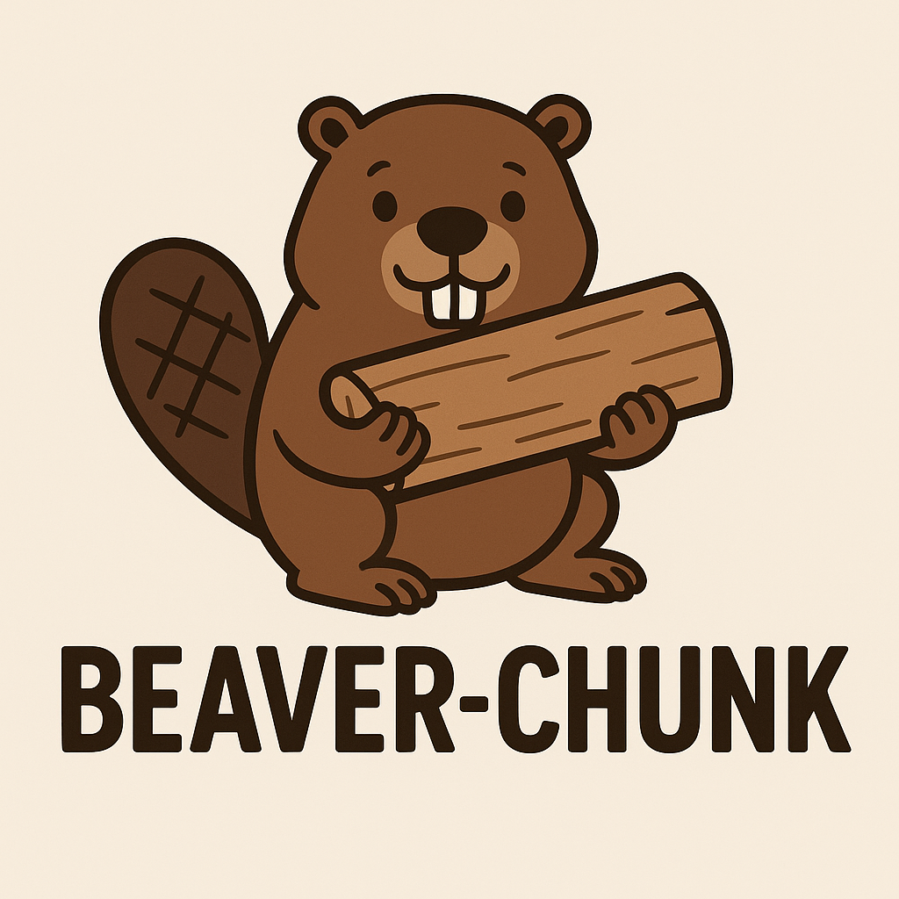

# 🦫 Beaver-Chunk

<p align="center">
  
</p>

<h1 align="center">Sistema Modular de Processamento de Documentos<br>
    <b>Beaver-Chunk</b>
</h1>

## 📋 Visão Geral

Beaver-Chunk é uma biblioteca Python modular para construção de pipelines de processamento de documentos, especialmente projetada para aplicações de RAG (Retrieval-Augmented Generation) e busca semântica. Com uma arquitetura baseada no padrão Factory, permite combinar diferentes componentes como blocos de LEGO para criar soluções personalizadas.

## ✨ Características Principais

- 📄 **Document Loaders Flexíveis**: Suporte para múltiplos formatos (PDF, TXT)
- ✂️ **Estratégias de Chunking Inteligentes**: Character-based e Recursive splitting
- 🧮 **Embeddings de Alta Qualidade**: Integração com modelos HuggingFace
- 💾 **Armazenamento Vetorial Eficiente**: Persistência com ChromaDB
- 🏭 **Padrão Factory**: Interface unificada e extensível
- 🔧 **Arquitetura Modular**: Fácil adição de novos componentes

## 🚀 Instalação

### Usando Poetry (Recomendado)

```bash
poetry install
```

### Usando pip

```bash
pip install langchain-text-splitters langchain-community pypdf langchain-huggingface sentence-transformers langchain-chroma rank-bm25 torch
```

### Requisitos

- Python 3.11+
- PyTorch 2.0+
- Dependências do LangChain

## 📖 Guia de Uso

### 1️⃣ Pipeline de Indexação Completo

```python
from src.factory import (
    get_document_loader, 
    get_chunker, 
    get_embedding, 
    get_vector_store
)

# Etapa 1: Carregar documentos
loader = get_document_loader(
    name="pdf",  # Opções: "txt", "pdf"
    path_document="data/seu_documento.pdf"
)
documentos = loader.get_documents()

# Etapa 2: Dividir em chunks
chunker = get_chunker(
    name="recursive",  # Opções: "character", "recursive"
    chunk_size=500,
    chunk_overlap=50
)
chunks = chunker.split_document(documentos)

# Etapa 3: Gerar embeddings
embedding = get_embedding(
    name="huggingface",
    model_name="sentence-transformers/all-MiniLM-L6-v2"
)
embedding_model = embedding.get_instance_for_vector_store()

# Etapa 4: Armazenar vetores
vector_store = get_vector_store(
    name="chroma",
    collection_name="minha_colecao",
    embeddings=embedding_model,
    persist_directory="./chroma_db"
)
vector_store.add(chunks)
```

### 2️⃣ Sistema de Recuperação

```python
from src.factory import get_embedding, get_vector_store

# Configurar componentes
embedding = get_embedding(
    name="huggingface",
    model_name="sentence-transformers/all-MiniLM-L6-v2"
)
embedding_model = embedding.get_instance_for_vector_store()

# Conectar ao vector store existente
vector_store = get_vector_store(
    name="chroma",
    collection_name="minha_colecao",
    embeddings=embedding_model,
    persist_directory="./chroma_db"
)

# Criar retriever e buscar
retriever = vector_store.get_instance_vector_store().as_retriever(
    search_kwargs={"k": 5}  # Retornar top 5 resultados
)
resultados = retriever.invoke("Sua pergunta aqui")

# Processar resultados
for doc in resultados:
    print(f"Conteúdo: {doc.page_content}")
    print(f"Metadados: {doc.metadata}")
    print("-" * 50)
```

## 🏗️ Arquitetura do Projeto

```
beaver-chunk/
├── 📁 src/
│   ├── 📂 document_loaders/        # Carregadores de documentos
│   │   ├── abstract_document_loaders.py
│   │   ├── pdf_loader.py
│   │   └── txt_loader.py
│   ├── 📂 chunking/                # Estratégias de divisão
│   │   ├── abstract_chunking.py
│   │   ├── character.py           # Divisão por caracteres
│   │   └── recursive.py           # Divisão recursiva
│   ├── 📂 embedding/               # Modelos de embedding
│   │   ├── abstract_embedding.py
│   │   └── huggingface.py
│   ├── 📂 vector_store/            # Armazenamento vetorial
│   │   ├── abstract_vector_store.py
│   │   └── chroma.py
│   ├── 📂 utils/                   # Utilidades
│   │   └── pos_processor/
│   └── 🏭 factory.py               # Factory pattern
├── 📁 exemple/                     # Exemplos práticos
│   ├── how_use_document_loaders.py
│   ├── how_use_chunking.py
│   ├── how_use_embeddings.py
│   └── how_use_vector_store.py
├── 📁 data/                        # Dados de exemplo
├── 📄 your_lego_indexing.py        # Script de indexação
├── 📄 your_lego_retriever.py       # Script de recuperação
└── 📄 pyproject.toml               # Configuração do projeto
```

## 🔌 Componentes Disponíveis

### Document Loaders

| Loader | Descrição | Parâmetros |
|--------|-----------|------------|
| `txt` | Carrega arquivos de texto simples | `path_document` |
| `pdf` | Extrai texto de PDFs | `path_document` |

### Chunking Strategies

| Strategy | Descrição | Parâmetros |
|----------|-----------|------------|
| `character` | Divisão por número de caracteres | `chunk_size`, `chunk_overlap` |
| `recursive` | Divisão recursiva preservando estrutura | `chunk_size`, `chunk_overlap` |

### Embeddings

| Model | Descrição | Parâmetros |
|-------|-----------|------------|
| `huggingface` | Modelos do HuggingFace Hub | `model_name` |

### Vector Stores

| Store | Descrição | Parâmetros |
|-------|-----------|------------|
| `chroma` | ChromaDB persistente | `collection_name`, `embeddings`, `persist_directory` |

## 🎯 Exemplos Práticos

### Exemplo 1: Pipeline Básico TXT → Chroma

```python
# Script completo em your_lego_indexing.py
from src.factory import (
    get_document_loader,
    get_chunker,
    get_embedding,
    get_vector_store
)

# Pipeline simples
loader = get_document_loader("txt", path_document="data/mock/description.txt")
docs = loader.get_documents()

chunker = get_chunker("character", chunk_size=500, chunk_overlap=0)
chunks = chunker.split_document(docs)

embedding = get_embedding("huggingface", 
                         model_name="sentence-transformers/all-MiniLM-L6-v2")
embed_model = embedding.get_instance_for_vector_store()

store = get_vector_store("chroma", 
                        collection_name="my_collection",
                        embeddings=embed_model,
                        persist_directory="./chroma_langchain_db")
store.add(chunks)
```

### Exemplo 2: Busca Semântica

```python
# Script completo em your_lego_retriever.py
retriever = vector_store.get_instance_vector_store().as_retriever()
docs = retriever.invoke("what did the president say about ketanji brown jackson?")
```

## 🔧 Extensibilidade

### Adicionando um Novo Document Loader

```python
# src/document_loaders/csv_loader.py
from src.document_loaders.abstract_document_loaders import AbstractDocumentLoader
import pandas as pd

class CSVLoader(AbstractDocumentLoader):
    def __init__(self, path_document, **kwargs):
        self.path = path_document
        self.kwargs = kwargs
    
    def get_documents(self):
        df = pd.read_csv(self.path, **self.kwargs)
        # Processar DataFrame para documentos
        return documents

# Registrar em src/factory.py
_LOADER_DOCUMENTS = {
    "csv": CSVLoader,
    # ... outros loaders
}
```

### Adicionando um Novo Modelo de Embedding

```python
# src/embedding/openai.py
from src.embedding.abstract_embedding import AbstractEmbedding

class OpenAIEmbedding(AbstractEmbedding):
    def __init__(self, api_key, model_name="text-embedding-ada-002"):
        # Implementação
        pass
    
    def get_instance_for_vector_store(self):
        # Retornar instância compatível com LangChain
        pass

# Registrar em src/factory.py
```

## 📊 Performance e Otimização

### Recomendações de Chunk Size

- **Documentos técnicos**: 500-1000 caracteres
- **Narrativas**: 1000-2000 caracteres
- **Q&A**: 200-500 caracteres

### Modelos de Embedding Recomendados

- **Uso geral**: `sentence-transformers/all-MiniLM-L6-v2`
- **Multilíngue**: `sentence-transformers/paraphrase-multilingual-MiniLM-L12-v2`
- **Alta precisão**: `sentence-transformers/all-mpnet-base-v2`

## 🐛 Troubleshooting

### Problema: Memória insuficiente ao gerar embeddings

```python
# Processar em batches
chunks_batch = chunks[:100]  # Processar 100 por vez
vector_store.add(chunks_batch)
```

### Problema: Resultados de busca irrelevantes

```python
# Ajustar parâmetros do retriever
retriever = vector_store.as_retriever(
    search_type="similarity_score_threshold",
    search_kwargs={"score_threshold": 0.5, "k": 10}
)
```

## 📝 Licença

Este projeto está licenciado sob a licença MIT - veja o arquivo [LICENSE](LICENSE) para detalhes.

## 👥 Autores

- **Maryane Castro** - *Desenvolvimento inicial* - [maryane.castro993@gmail.com](mailto:maryane.castro993@gmail.com)

## 🤝 Contribuindo

Contribuições são muito bem-vindas! Por favor, siga estes passos:

1. Fork o projeto
2. Crie sua feature branch (`git checkout -b feature/NovaFuncionalidade`)
3. Commit suas mudanças (`git commit -m 'Adiciona nova funcionalidade'`)
4. Push para a branch (`git push origin feature/NovaFuncionalidade`)
5. Abra um Pull Request

### Guidelines para Contribuição

- Mantenha o padrão de código existente
- Adicione testes para novas funcionalidades
- Atualize a documentação conforme necessário
- Certifique-se de que todos os testes passem

## 📚 Recursos Adicionais

- [Documentação LangChain](https://python.langchain.com/)
- [HuggingFace Hub](https://huggingface.co/models)
- [ChromaDB Docs](https://docs.trychroma.com/)
- [Sentence Transformers](https://www.sbert.net/)

## 🚦 Status do Projeto

🟢 **Ativo** - Em desenvolvimento contínuo


---
